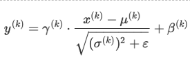
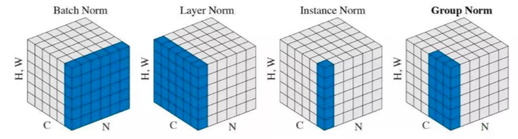

### 计算机视觉岗常见面试题

#### 问题1：Softmax+Cross Entropy反向求导
[推导过程](https://blog.csdn.net/jiajunlee/article/details/79665062)

#### 问题2：BatchNorm层的详细解读(具体可以参考之后出版的百面深度学习2333)
  + 
  + 作用：
    - 使得每层的输入/输出分布更加稳定，避免参数更新和网络层次变深大幅度影响数据分布。从而使模型训练更稳定。
  + 参数 β 和 γ的作用
    + 保留网络各层在训练过程中的学习成果
    + 保证激活单元的非线性表达能力 
    + 使批归一化模块具有复原初始输出分布能力。

  + BN放在激活层之前还是之后 
  + 各种不同的Norm
  + [阅读材料](https://zhuanlan.zhihu.com/p/33173246)


#### 问题3：Conv+BN加速策略
在inference阶段，可以将BN层的参数和在之前的Linear或Conv层中，加速推断时间（因为二者都是线性变换）。
```python
w = module.weight.data
b = module.bias.data      # conv的bias可以用全0代替
ws = [1] * len(w.size())
ws[0] = w.size()[0]

invstd = bn_module.running_var.clone().add_(bn_module.eps).pow_(-0.5)
w.mul_(invstd.view(*ws).expand_as(w))
b.add_(-bn_module.running_mean).mul_(invstd)

if bn_module.affine:
    w.mul_(bn_module.weight.data.view(*ws).expand_as(w))
    b.mul_(bn_module.weight.data).add_(bn_module.bias.data)

```

#### 问题4：常见的模型加速方法

#### 问题5：目标检测里如何有效解决常见的前景少背景多的问题

#### 问题6：目标检测里有什么情况是SSD、YOLOv3、Faster R-CNN等所不能解决的，假设网络拟合能力无限强

#### 问题7：分类和检索两个问题可以怎么理解

#### 问题8：ROIPool和ROIAlign的区别，以及ROIAlign的简单实现（不考虑并行，cpu串行即可）
 [区别](https://blog.csdn.net/kk123k/article/details/86563425)

#### 问题9：深度神经网络常见的参数初始化方式，如果全部初始化为0，会出现什么情况

#### 问题10：多卡并行的时候怎么实现参数共享，通信梯度是指平均梯度，还是最大梯度，还是梯度总和

#### 问题11：介绍常见的梯度下降优化方法

#### 问题12: 神经网络（卷积/全连接）反向传播公式推导

#### 问题13: Focal Loss解决了什么问题，如何解决的，与OHEM有什么不同

#### 问题14: 斜着的矩形框如何求iou, 两个多边形的框如何求iou

#### 问题15: Detection你觉的还有哪些可做的点

#### 问题16: 卷积底层如何实现的

#### 问题17: mini-Batch SGD相对于GD有什么优点

#### 问题18: DCN比普通卷积多了多少计算量

#### 问题19: SyncBN如何实现的

#### 问题20：当需要添加背景类时，怎样处理比较合理

#### 问题21：给出语义分割评估指标mIOU的计算公式和实现

#### 问题22：人体姿态估计主流的两个做法是啥？简单介绍下

#### 问题23：介绍带孔卷积以及其优势与劣势

#### 问题24：Non-local模块与Self-attention的之间的关系与区别

#### 问题25：PyTorch和TensorFlow的运行原理

#### 问题26：卷积的实现原理以及如何快速高效实现局部weight sharing的卷积操作方式

#### 问题27：详解几种优化算法

#### 问题28：BN在training和inference的时候有什么区别

